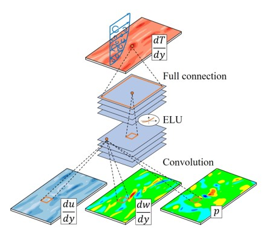

## Prediction of turbulent heat transfer using convolutional neural networks
#### by Junhyuk Kim and Changhoon Lee
#### Journal of fluid mechanics, 2020, 882, A18
#### Article link : <https://doi.org/10.1017/jfm.2019.814>

As shown in figure, we applied convolutional neural network(CNN) to the prediction of turbulent heat transfer in wall-bounded turbulence. CNN is constructed to predict the wall-normal heat flux based on the nearby other wall information including wall-shear stresses and pressure. As training results, very high prediction accuracy could be acceived even at a higher Reynolds number than the trained one. It stands for the existence of nonlinear relationship between the heat transfer and other wall information. We tried to figure out the spatial relationship between input and the heat transfer. The deep neural network is well-known as a black box method, however, through observation of a gradient map with statistical sense, we found that the trained CNN contains meaningful patterns that reveal underlying physics. In future work, our framework could be extended to other problems including turbulence reconstruction, turbulence control, and especially other turbulence physics analysis.  

Code related to our article is given here. Our code is written in tensorflow library with version 1.X. If you use tensorflow version 2.0, see <https://www.tensorflow.org/guide/migrate>. In our code, minor things are omitted for simplicity. The example network in the code(Network.py) is composed of three 3x3 convolution layers and one 11x11 convolution layer.

Some data, 100 instantaneous flow fields, are also given here. They are composed of 2D flow fields including du/dy, dw/dy, p, and dT/dy. In the given data, the mean values of input data are subtracted, and they are 180 (of du/dy), 0 (of dw/dy), and 0 (of p), respectively. That of dT/dy is not subtracted. Root-mean-square values of given data are 66.274826292 (of du/dy), 37.0097954241 (of dw/dy), and 1.58318422533 (of p), respectively.

If you have any questions about the article and the code, please email <junhyuk6@yonsei.ac.kr> or <clee@yonsei.ac.kr>.
